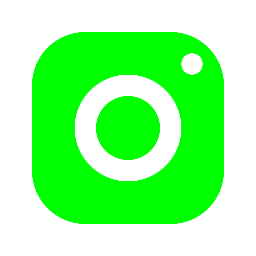

# utils
> These are the helping function, which will help to avoid reparation of code, this it will allow to draw shapes, text, with more prettier way, since we don't have many option opencv, to control the transparency of shape, or draw text with background, just use this, function, and you are good to go. 

#### [Blog Post for more details](https://aiphile.blogspot.com/2021/08/draw-transparent-shape-text-with.html)
---
## Opencv Text Beautification
---
### textWithBackground

This function Calculates the size of text, using opencv Function, getTextSize, on the base of height and width, we add here the extra padding(x,y) to increase the background, to look it more decent.


```Python
#Call the function
img=textWithBackground(img, 'Colored Background Texts', cv.FONT_HERSHEY_COMPLEX, 1.6, (60,70), textThickness=3, bgColor=(0,255,0), textColor=(0,0, 0), bgOpacity=0.5, pad_x=10, pad_y=10)


```
---
###  textBlurBackground

The function, calculates the size of input Text and apply some padding (x,y), which is decidable, apply blur to the ROI, and Draws Text upon the blurred background.

```Python
#Call the function
 textBlurBackground(img, 'Blured Background Text', cv.FONT_HERSHEY_COMPLEX, 1.4, (60, 140),3, (0,255, 0), (71,71), 13, 13)

```
---
### *Results of Above Function*
---


---

###  Different colors 
----
|BLACK|WHITE|BLUE|RED|CYAN|YELLOW|MAGENTA|GRAY|GREEN| PURPLE|ORANGE|PINK|
|-------|--------|------|-----|------|--------|---------|-------|-------|--------|--------|-


## Draw shapes with Transparency

### fillPolyTrans
Draw any Shape with Transparency, the function is similar to Opencv PolyFill, just it takes a list of tuples, instead of numpy array,
here you have option to control the Transparency of shape as well, 

```python
# call the function
img =fillPolyTrans(img=img, points=points_list, color=(0,255,0), opacity=.5)

```

### rectTrans 

This function allows to draw a rectangle with transparency, similar to opencv rectangle it has opacity 

```python
    # call the function.
        img=rectTrans(img, pt1=(30, 320), pt2=(160, 260), color=(0,255,255),thickness=-1, opacity=0.6)

```

this Repository will be updated on regular interval, here I have write code to avoid repeating of code, so I thought it would be great to share with other people, I have blog as will, you get more details of this, blog post.

I have youtube Channel with subscribers , If you can increase that counter, go a head do this for me 😃, just kidding as always ;-)  [AiPhle](https://youtube.come/c/aiphle) is all about Computer Vision, AI and Electronics.

hope you found this helpful,  if you want to ask me any thing then here are my social medias. 

## :green_heart: Join Me on Social Media :green_heart:

<a href="https://www.youtube.com/c/aiphile"> </a>
<a href="https://www.facebook.com/AIPhile17">

</a>
<a href="https://www.instagram.com/aiphile17/"> 
</a>
<a href="https://github.com/Asadullah-Dal17"> 
</a>
